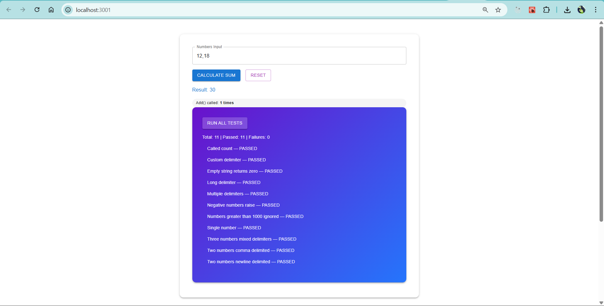

# String Calculator — TDD Kata (React + Flask)

This project is a **full-stack implementation** of the String Calculator Kata using **React (Vite, MUI)** for the frontend and **Flask (Python)** for the backend.  
It demonstrates TDD principles with a full suite of **unit tests** and a UI to **calculate sums, run all tests, and view requirements**.

---

## 📂 Project Structure

```
.
├── backend/
│   ├── app.py                  # Flask server
│   ├── string_calculator.py    # Core StringCalculator logic
│   ├── test_string_calculator.py # Unit tests for StringCalculator
│
├── frontend/
│   ├── index.html              # Vite entry point
│   ├── public/
│   │   └── favicon.ico
│   └── src/
│       ├── App.jsx             # Main app shell
│       ├── main.jsx            # React bootstrap
│       └── components/
│           ├── CalculatorForm.jsx  # Calculator + Reset + Test Runner
│           ├── TestRunner.jsx      # Run All Tests block
│           └── Features.jsx        # Feature list cards
│
├── .gitignore
└── README.md
```

---

## Prerequisites

- **Python** 3.9+  
- **Node.js** 18+ and **npm**  
- **pip** (Python package manager)

---

## Setup & Running

### 1. Clone Repo
```bash
git clone <your-repo-url>
cd string-calculator
```

### 2. Backend Setup (Flask)
```bash
cd backend
python -m venv venv
source venv/bin/activate   # On Windows: venv\Scripts\activate

pip install flask
```

Run backend:
```bash
python app.py
```

The backend will start at **http://localhost:5000**

---

### 3. Frontend Setup (React + Vite)
Open a new terminal:
```bash
cd frontend
npm install
npm start
```

The frontend dev server will start (default **http://localhost:5173**).

---

### 4. Production Build (Optional)
To serve the React app from Flask instead of Vite dev server:

```bash
cd frontend
npm run build
```

This generates `/frontend/dist/`.  
Now start Flask again (`python app.py`) and visit **http://localhost:5000**.

---

## Running Tests

The backend has a full **unit test suite**:

```bash
cd backend
python -m unittest
```

You can also run tests via the **UI**:  
- Open the app in browser  
- Click **Run Tests** → see results inline  

---

##  Features

-  Add() handles 0, 1, or 2 numbers  
-  Returns 0 for empty string  
-  Handles unknown amount of numbers  
-  Supports `\n` newlines between numbers  
-  Custom delimiters (`//;\n1;2`)  
-  Negative numbers → throw exception listing all negatives  
-  Ignore numbers > 1000  
-  Multi-character delimiters (`//[***]\n1***2***3`)  
-  Multiple delimiters (`//[*][%]\n1*2%3`)  
-  Decimal numbers **not allowed**  
-  `GetCalledCount()` method tracked and shown in UI  
-  Full test suite integration in frontend  

---

##  UI

- Built with **Material UI** (MUI v5)  
- Responsive card layout  
- Equal-height feature boxes  
- Embedded **Run All Tests** card under calculator  
- Reset button clears input, output, test results, and call count  

---

##  Demo

- **Calculate Sum**: Enter numbers with supported delimiters and see the result.  
    
- **Run All Tests**: Runs backend unit tests and lists results with status chips.
      
- **Reset**: Resets calculator state + test runner.  
    
---

##  API Endpoints

###  Add numbers
```bash
curl -X POST http://localhost:5000/api/add -H "Content-Type: application/json" -d '{"input":"1,2,3"}'
```
Response:
```json
{ "ok": true, "result": 6, "calledCount": 1 }
```

###  Reset calculator
```bash
curl -X POST http://localhost:5000/api/reset
```
Response:
```json
{ "ok": true, "calledCount": 0 }
```

###  Run all tests
```bash
curl -X POST http://localhost:5000/api/run-tests
```
Response:
```json
{
  "summary": { "total": 11, "failures": 0, "errors": 0, "passed": 11 },
  "results": [ { "name": "Test two numbers comma delimited", "status": "passed" } ],
  "raw": "..."
}
```

---

##  Contributing

1. Fork the repo  
2. Create a feature branch  
3. Commit changes with clear messages  
4. Submit PR  

---

## License

MIT License © 2025  
